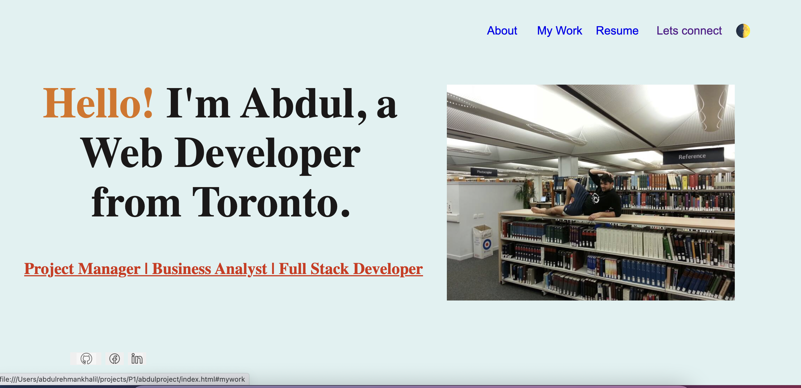

# Project Title: HTML code refactor

## Name: Abdul Khalil
## [GitHub](https://github.com/absk786)
## [link to project](https://absk786.github.io/abdulproject/)

## Table of Contents:
* [Description](https://github.com/absk786/assignment7/blob/main/README.md#Description)
* [Installation](https://github.com/absk786/assignment7/blob/main/README.md#Installation)
* [Usage](https://github.com/absk786/assignment7/blob/main/README.md#Usage)
* [Licences](https://github.com/absk786/assignment7/blob/main/README.md#License)
* [Languages](https://github.com/absk786/assignment7/blob/main/README.md#Languages)
* [Features](https://github.com/absk786/assignment7/blob/main/README.md#Features)
* [Tests](https://github.com/absk786/assignment7/blob/main/README.md#Tests)
* [Contributors](https://github.com/absk786/assignment7/blob/main/README.md#Contributors)

-------------------------------------------------------------------------------------
### Description: 
* we refactored HTML code to use semantics 

### Installation: 
* no packages
 
### Usage: 
* undefined

### Languages: 
* HTML

### License:
* 

### Features: 
* no features

### Tests: 
* no tests added

### Contributors: 
* no other contributors

Questions
* for any questions please email me at rehmank11@gmail.com
